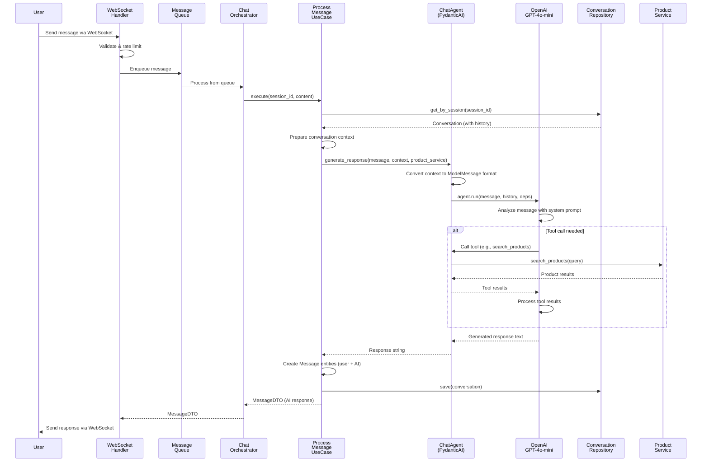
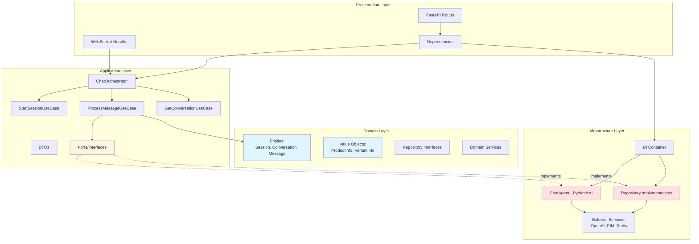
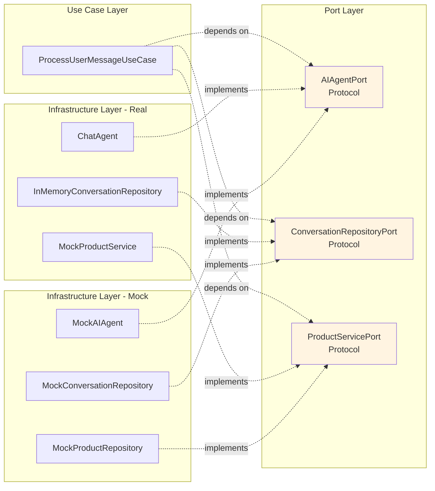

# PydanticAI Chat Application - Architecture Deep Dive

## Executive Summary

This document provides an advanced, comprehensive analysis of the PydanticAI-powered
chat application architecture, explaining how user messages flow through the system to
generate LLM-powered responses, how Domain-Driven Design (DDD) principles are
implemented across all layers, and how dependency injection enables flexible
interface/implementation separation.

**Key Architectural Patterns:**
- **Domain-Driven Design (DDD)** with clear layer separation
- **Hexagonal Architecture** (Ports & Adapters) for infrastructure independence
- **Dependency Injection Container** for loose coupling and testability
- **Repository Pattern** for data access abstraction
- **Use Case Pattern** for business operation encapsulation
- **Aggregate Pattern** for consistency boundary enforcement

---

## System Overview

The application is a real-time chat assistant for a B2B steel products company, built with:

- **FastAPI** - Async web framework with WebSocket support
- **PydanticAI** - Type-safe AI agent framework with tool support
- **OpenAI GPT-4o-mini** - LLM for natural language understanding
- **Redis** (mock in MVP) - Session and cache storage
- **Pydantic** - Data validation and serialization
- **Python 3.11+** - Modern async/await patterns

**Core Capabilities:**
- Real-time WebSocket communication
- Context-aware conversation management
- Product search and information retrieval via LLM tools
- Multi-session support with reconnection handling
- Environment-based mock/real implementation switching

---

## Complete Message Flow: User Input → LLM → Response

### High-Level Flow Diagram



### Detailed Step-by-Step Flow

#### Phase 1: WebSocket Connection & Initialization

**File:** `src/presentation/api/v1/websocket.py`

```python
@router.websocket("/ws/{session_id}")
async def websocket_endpoint(
    websocket: WebSocket,
    session_id: str,
    chat_orchestrator: ChatOrchestrator = Depends(get_chat_orchestrator),
):
    chat_ws = ChatWebSocket(chat_orchestrator)
    await chat_ws.websocket_endpoint(websocket, session_id)
```

**What happens:**
1. FastAPI WebSocket endpoint accepts connection
2. `Depends(get_chat_orchestrator)` triggers dependency injection
3. `get_chat_orchestrator()` creates orchestrator with all dependencies
4. `ChatWebSocket` instance wraps the orchestrator
5. Connection established, welcome message sent

**Key Design Decision:** Using FastAPI's dependency injection (`Depends`) ensures the
orchestrator and all its dependencies are created fresh for each WebSocket connection,
maintaining proper lifecycle management.

---

#### Phase 2: Dependency Injection Setup

**File:** `src/presentation/dependencies.py`

```python
async def get_chat_orchestrator() -> AsyncGenerator[ChatOrchestrator, None]:
    container = InfrastructureContainer.instance()

    start_session_use_case = StartChatSessionUseCaseImpl(
        session_repository=None,
        redis_client=container.redis_client,
    )

    process_message_use_case = ProcessUserMessageUseCaseImpl(
        chat_agent=container.ai_agent,
        product_service=container.product_service,
        conversation_repository=container.conversation_repository,
    )

    get_conversation_use_case = GetConversationUseCaseImpl(
        conversation_repository=container.conversation_repository
    )

    orchestrator = ChatOrchestrator(
        start_session_use_case=start_session_use_case,
        process_message_use_case=process_message_use_case,
        get_conversation_use_case=get_conversation_use_case,
    )

    yield orchestrator
```

**What happens:**
1. Retrieve singleton container (initialized at app startup)
2. Container provides implementations (mock or real based on environment)
3. Access dependencies via properties (`container.ai_agent`, not `container.get_ai_agent()`)
4. Create use case implementations with injected dependencies
5. Assemble orchestrator with use cases
6. Yield orchestrator to endpoint

**Key Design Decision:** Constructor injection makes dependencies explicit and enables
easy testing. The container pattern centralizes object creation and lifecycle
management. Property-based access is more Pythonic than getter methods.

---

#### Phase 3: Message Reception & Validation

**File:** `src/presentation/websocket/chat_ws.py`

```python
async def _handle_user_message(
    self, connection_id: str, session_id: str, message: WebSocketMessage
):
    # Validate message content
    is_valid, error_msg = self.message_validator.validate_user_message(
        message.message if message.message else ""
    )
    if not is_valid:
        await self._send_validation_error(connection_id, error_msg or "Invalid message")
        return

    # Check enhanced rate limit
    is_allowed, rate_error = self.message_rate_limiter.is_allowed(connection_id)
    if not is_allowed:
        await self._send_validation_error(connection_id, rate_error or "Rate limit exceeded")
        return

    # Sanitize message for safe display
    sanitized_message = self.message_validator.sanitize_message(message.message or "")

    # Queue message for processing
    message_data = {
        "connection_id": connection_id,
        "session_id": session_id,
        "content": message.message,
        "metadata": message.metadata,
    }

    queued = await self.message_queue.add_message(message_data)
```

**What happens:**
1. Message received from WebSocket
2. Content validation (length, format)
3. Rate limiting check (prevent abuse)
4. Message sanitization (XSS prevention)
5. Typing indicator sent to user
6. Message queued for async processing

**Key Design Decision:** Queueing messages decouples reception from processing, enabling
better resource management and graceful degradation under load.

---

#### Phase 4: Use Case Execution

**File:** `src/application/use_cases/process_message.py`

```python
async def execute(
    self,
    session_id: str,
    content: str,
    metadata: Optional[Dict[str, Any]] = None,
) -> MessageDTO:
    # 1. Get or create conversation
    conversation = await self.conversation_repository.get_by_session(session_id)
    if not conversation:
        conversation = Conversation(
            session_id=session_id,
            metadata=metadata or {},
        )

    # 2. Prepare conversation context BEFORE adding new message
    context = {
        "conversation_history": [
            {"sender": msg.sender_type, "content": msg.content}
            for msg in conversation.get_context(limit=4)
        ],
        "session_id": session_id,
    }

    # 3. Create user message entity
    user_message = Message(
        conversation_id=conversation.id,
        sender_type="user",
        content=content,
        metadata=metadata or {},
    )

    # 4. Generate AI response using single agent with tools
    message_dtos = [
        MessageDTO(
            content=msg.content,
            sender_type=msg.sender_type,
            session_id=session_id,
            conversation_id=conversation.id,
            timestamp=msg.created_at,
            metadata=msg.metadata,
        )
        for msg in conversation.get_context(limit=4)
    ]

    response_content = await self.chat_agent.generate_response(
        message=content,
        conversation_context=message_dtos if message_dtos else None,
        product_service=self.product_service,
        session_id=session_id,
    )

    # 5. Add user message to conversation
    conversation.add_message(user_message)

    # 6. Create AI response message
    ai_message = Message(
        conversation_id=conversation.id,
        sender_type="ai_agent",
        content=response_content,
        metadata={
            "model": "gpt-4o-mini",
            "context_used": len(context["conversation_history"]),
        },
    )
    conversation.add_message(ai_message)

    # 7. Save conversation with both messages
    await self.conversation_repository.save(conversation)

    # 8. Return AI message as DTO
    return MessageDTO(
        content=ai_message.content,
        sender_type=ai_message.sender_type,
        session_id=session_id,
        conversation_id=ai_message.conversation_id,
        timestamp=ai_message.created_at,
        metadata=ai_message.metadata,
    )
```

**What happens:**
1. Retrieve existing conversation or create new one
2. Extract recent messages for context (last 4 = 2 exchanges)
3. Create user Message entity (domain object)
4. Convert context to DTOs for AI agent
5. Call AI agent with message, context, and product service
6. Create AI response Message entity
7. Add both messages to Conversation aggregate
8. Persist conversation via repository
9. Return MessageDTO to orchestrator

**Key Design Decision:** Use case orchestrates the workflow without knowing infrastructure
details. It works with domain entities and uses repository abstractions, maintaining
layer separation.

---

#### Phase 5: AI Agent Processing with PydanticAI

**File:** `src/infrastructure/ai/chat_agent.py`

```python
async def generate_response(
    self,
    message: str,
    conversation_context: Optional[List[MessageDTO]] = None,
    product_service: Optional[ProductServicePort] = None,
    session_id: Optional[str] = None,
) -> str:
    # Convert DTOs to PydanticAI ModelMessage format
    message_history = None
    if conversation_context and len(conversation_context) > 0:
        message_history = self._convert_dto_to_model_messages(
            conversation_context
        )

    # Create dependencies for tools
    deps = ChatDependencies(
        product_service=product_service or self._create_mock_product_service(),
        session_id=session_id or "default",
        user_metadata={},
    )

    # Run the agent with proper message history
    result = await self.agent.run(
        message,
        message_history=message_history,
        deps=deps,
    )

    # Extract response from PydanticAI AgentRunResult
    response_str: str = (
        result.output if hasattr(result, "output") else str(result)
    )

    return response_str
```

**Agent Tool Registration (excerpt):**

```python
@self.agent.tool
async def search_products(
    ctx: RunContext[ChatDependencies], query: str
) -> ProductSearchResult:
    """Search for steel product categories based on query."""
    return await self._search_products_tool(ctx, query)

@self.agent.tool
async def get_product_variants(
    ctx: RunContext[ChatDependencies], product_id: str
) -> VariantSearchResult:
    """Get all variants for a specific product category."""
    return await self._get_product_variants_tool(ctx, product_id)
```

**What happens:**
1. Convert MessageDTOs to PydanticAI's ModelMessage format
2. Create ChatDependencies with product_service and session_id
3. Call `agent.run()` with message, history, and dependencies
4. PydanticAI agent:
   - Analyzes message with system prompt
   - Determines if tools are needed
   - Calls registered tools via RunContext
   - Tools access product_service from ctx.deps
   - Generates natural language response
5. Extract response string from result
6. Return to use case

**Key Design Decision:** PydanticAI's RunContext pattern enables dependency injection at
the tool level. Tools can access product_service without global state, maintaining
testability and clean architecture.

---

#### Phase 6: Tool Execution (when needed)

**Tool Implementation Example:**

```python
async def _search_products_tool(
    self, ctx: RunContext[ChatDependencies], query: str
) -> ProductSearchResult:
    # Access product_service from dependencies
    products = await ctx.deps.product_service.search_products(query)

    product_list = []
    for product in products:
        product_data = {
            "product_id": product.product_id,
            "product_name": product.product_name,
            "description": product.product_description,
            "category": product.category,
            "variant_count": product.variant_count,
        }
        product_list.append(product_data)

    return ProductSearchResult(
        products=product_list,
        query=query,
        count=len(product_list),
        success=True,
    )
```

**What happens:**
1. LLM determines tool call is needed based on user query
2. PydanticAI invokes registered tool function
3. Tool accesses product_service from RunContext dependencies
4. Product service queries data (from PIM system or mock)
5. Tool returns structured Pydantic model result
6. PydanticAI provides tool result to LLM
7. LLM generates natural language response incorporating tool data

**Key Design Decision:** Structured tool outputs (Pydantic models) ensure type safety and
enable LLM to reliably parse results. Tool functions are async, allowing efficient I/O
operations.

---

#### Phase 7: Response Delivery

**File:** `src/presentation/websocket/chat_ws.py`

```python
async def _process_queued_message(self, message_data: Dict[str, Any]):
    connection_id = message_data["connection_id"]
    session_id = message_data["session_id"]
    content = message_data["content"]
    metadata = message_data.get("metadata")

    try:
        # Process message through orchestrator
        response = await self.chat_orchestrator.handle_user_message(
            session_id=session_id, content=content, metadata=metadata
        )

        # Send AI response
        response_message = {
            "type": MessageType.AI_RESPONSE.value,
            "message": response.content,
            "metadata": response.metadata,
            "timestamp": (response.timestamp or datetime.now()).isoformat(),
        }

        # Send to requester
        await self.send_personal_message(response_message, connection_id)

        # Broadcast to session (multi-device support)
        await self.broadcast_to_session(
            response_message,
            session_id=session_id,
            exclude_connection=connection_id,
        )

    except Exception as e:
        logger.error(f"Failed to process message: {e}", exc_info=True)
        await self._send_error(
            connection_id, "Maaf, terjadi kesalahan. Silakan coba lagi."
        )
```

**What happens:**
1. Orchestrator returns MessageDTO
2. WebSocket handler formats response message
3. Response sent to requesting connection
4. Response broadcasted to other connections in same session (multi-device)
5. Error handling ensures user receives feedback even on failure

---

## Domain-Driven Design Implementation

### Layer Architecture



### Layer Responsibilities

#### Domain Layer (`src/domain/`)

**Purpose:** Pure business logic with zero infrastructure dependencies

**Components:**

1. **Entities** (`src/domain/entities/`)
   - `BaseEntity`: Base class providing id, timestamps, is_active
   - `Session`: User session entity (links to conversations)
   - `Conversation`: Aggregate root containing messages
   - `Message`: Individual chat message entity

2. **Value Objects** (`src/domain/value_objects/`)
   - `ProductInfo`: Product category information
   - `VariantInfo`: Specific product variant details
   - `ProductWithVariantsInfo`: Complete product with all variants
   - `QueryIntent`: Analyzed user query intent

3. **Repository Interfaces** (`src/domain/repositories/`)
   - Define contracts without implementation
   - Use Python `Protocol` for structural typing

**Example - Conversation Aggregate:**

```python
class Conversation(BaseEntity):
    """Aggregate root for chat conversations"""

    session_id: str
    messages: List["Message"] = Field(default_factory=list)
    started_at: datetime = Field(default_factory=lambda: datetime.now(timezone.utc))
    last_activity: datetime = Field(default_factory=lambda: datetime.now(timezone.utc))
    metadata: Dict[str, Any] = Field(default_factory=dict)

    def add_message(self, message: "Message"):
        """Add a message to the conversation"""
        self.messages.append(message)
        self.last_activity = datetime.now(timezone.utc)  # Enforce invariant

    def get_context(self, limit: int = 10) -> List["Message"]:
        """Get recent messages for context"""
        return self.messages[-limit:] if self.messages else []
```

**Key Design Decision:** Conversation is an aggregate root that enforces the invariant
"last_activity must be updated when messages are added". External code cannot bypass
this by directly modifying the messages list.

---

#### Application Layer (`src/application/`)

**Purpose:** Orchestrate domain objects and infrastructure, define use cases

**Components:**

1. **Use Cases** (`src/application/use_cases/`)
   - `StartChatSessionUseCase`: Initialize or resume a session
   - `ProcessUserMessageUseCase`: Process incoming message and generate response
   - `GetConversationUseCase`: Retrieve conversation history

2. **Ports (Interfaces)** (`src/application/ports/`)
   - `AIAgentPort`: Interface for AI agent implementations
   - `ProductServicePort`: Interface for product data access
   - `ConversationRepositoryPort`: Interface for conversation persistence

3. **DTOs** (`src/application/dto/`)
   - `SessionDTO`: Session data transfer object
   - `MessageDTO`: Message data transfer object
   - `ConversationDTO`: Conversation data transfer object

4. **Services** (`src/application/services/`)
   - `ChatOrchestrator`: Coordinates multiple use cases

**Example - Port Definition:**

```python
class AIAgentPort(Protocol):
    async def generate_response(
        self,
        message: str,
        conversation_context: Optional[List[MessageDTO]] = None,
        product_service: Any = None,
        session_id: Optional[str] = None,
    ) -> str:
        ...
```

**Key Design Decision:** Ports use Python's `Protocol` for structural subtyping. Any class
implementing the required methods automatically satisfies the interface, enabling flexible
implementations without inheritance.

---

#### Infrastructure Layer (`src/infrastructure/`)

**Purpose:** Implement ports, integrate with external systems

**Components:**

1. **Repositories** (`src/infrastructure/repositories/`)
   - `InMemoryConversationRepository`: In-memory storage implementation
   - Implements `ConversationRepositoryPort` protocol

2. **AI Integration** (`src/infrastructure/ai/`)
   - `ChatAgent`: PydanticAI-based agent implementation
   - Implements `AIAgentPort` protocol
   - Registers tools for LLM use

3. **External Services** (`src/infrastructure/external_services/`)
   - PIM system integration (planned)
   - Redis client wrapper

4. **Mocks** (`src/infrastructure/mocks/`)
   - Mock implementations for testing and development
   - `MockAIAgent`, `MockProductRepository`, etc.

5. **Container** (`src/infrastructure/container.py`)
   - Dependency injection container
   - Manages object lifecycle and configuration

**Example - Repository Implementation:**

```python
class InMemoryConversationRepository:
    """Thread-safe in-memory conversation storage"""

    def __init__(self):
        self.conversations: Dict[str, Conversation] = {}
        self.lock = Lock()

    async def save(self, conversation: Conversation) -> None:
        async with self.lock:
            self.conversations[conversation.session_id] = conversation

    async def get_by_session(self, session_id: str) -> Optional[Conversation]:
        async with self.lock:
            return self.conversations.get(session_id)

    async def delete(self, session_id: str) -> None:
        async with self.lock:
            if session_id in self.conversations:
                del self.conversations[session_id]
```

**Key Design Decision:** Repository implements the port protocol without explicit
inheritance. Thread-safety via `asyncio.Lock` ensures concurrent access doesn't corrupt
data.

---

#### Presentation Layer (`src/presentation/`)

**Purpose:** Handle HTTP/WebSocket, format requests/responses

**Components:**

1. **API Routes** (`src/presentation/api/`)
   - WebSocket endpoint definition
   - Health check endpoints

2. **WebSocket Handlers** (`src/presentation/websocket/`)
   - `ChatWebSocket`: Main WebSocket connection handler
   - Connection management, message queueing, rate limiting

3. **Dependencies** (`src/presentation/dependencies.py`)
   - FastAPI dependency injection functions
   - Assembles orchestrator with dependencies

**Example - Dependency Injection:**

```python
async def get_chat_orchestrator() -> AsyncGenerator[ChatOrchestrator, None]:
    container = InfrastructureContainer.instance()

    # Create use cases with dependencies from container (property access)
    start_session_use_case = StartChatSessionUseCaseImpl(
        session_repository=None,
        redis_client=container.redis_client,
    )

    process_message_use_case = ProcessUserMessageUseCaseImpl(
        chat_agent=container.ai_agent,
        product_service=container.product_service,
        conversation_repository=container.conversation_repository,
    )

    get_conversation_use_case = GetConversationUseCaseImpl(
        conversation_repository=container.conversation_repository
    )

    # Assemble orchestrator
    orchestrator = ChatOrchestrator(
        start_session_use_case=start_session_use_case,
        process_message_use_case=process_message_use_case,
        get_conversation_use_case=get_conversation_use_case,
    )

    yield orchestrator
```

**Key Design Decision:** Dependencies assembled at presentation layer but come from
container. This keeps FastAPI integration separate from business logic while enabling
proper dependency management.

---

## Dependency Injection & Container Pattern

### Container Architecture

```mermaid
graph TB
    subgraph "Application Startup"
        Main[main.py:<br/>App Initialization]
        Lifespan[lifespan() context]
    end

    subgraph "Container Singleton"
        Instance[InfrastructureContainer.instance]
        Singleton[_instance: InfrastructureContainer]
        DetectMode{Detect Mode<br/>USE_MOCK_MODE}
    end

    subgraph "Mode Selection"
        SetupMocks[_setup_mocks]
        SetupReal[_setup_real]
    end

    subgraph "Mock Components"
        MockRedis[MockRedisClient]
        MockRepo[MockConversationRepository]
        MockProduct[MockProductRepository]
        MockAgent[MockAIAgent]
    end

    subgraph "Real Components"
        RealRepo[InMemoryConversationRepository]
        RealProduct[MockProductService]
        RealAgent[ChatAgent - PydanticAI]
        OpenAI[OpenAI API]
    end

    Main --> Lifespan
    Lifespan --> Instance
    Instance --> Singleton
    Singleton -.first call.-> DetectMode
    DetectMode -->|mock mode| SetupMocks
    DetectMode -->|real mode| SetupReal

    SetupMocks --> MockRedis
    SetupMocks --> MockRepo
    SetupMocks --> MockProduct
    SetupMocks --> MockAgent

    SetupReal --> RealRepo
    SetupReal --> RealProduct
    SetupReal --> RealAgent
    RealAgent --> OpenAI

    style Singleton fill:#ffe1e1
    style MockAgent fill:#e1f5ff
    style RealAgent fill:#e1ffe1
```

### Container Implementation

**File:** `src/infrastructure/container.py`

```python
class InfrastructureContainer:
    """
    Dependency injection container supporting mock and real implementations.

    The container uses a singleton pattern to ensure consistent dependency
    instances across the application. Mode (mock vs real) can be configured
    via environment variable or explicit parameter.

    Usage:
        # Get singleton instance
        container = InfrastructureContainer.instance()

        # Access dependencies via properties (not methods!)
        agent = container.ai_agent
        products = container.product_service

        # Reset singleton (for testing)
        InfrastructureContainer.reset()

    Environment Variables:
        USE_MOCK_MODE: "true"/"1"/"yes" for mocks, "false"/"0"/"no" for real
        OPENAI_API_KEY: Required for real ChatAgent implementation
    """

    _instance: Optional["InfrastructureContainer"] = None

    @classmethod
    def instance(cls, use_mocks: Optional[bool] = None) -> "InfrastructureContainer":
        """
        Get or create singleton container instance.

        Args:
            use_mocks: Override mode detection. If None, uses environment.

        Returns:
            Singleton container instance
        """
        if cls._instance is None:
            cls._instance = cls(use_mocks=use_mocks)
        return cls._instance

    @classmethod
    def reset(cls) -> None:
        """Reset singleton instance (for testing)."""
        cls._instance = None

    def __init__(self, use_mocks: Optional[bool] = None):
        """Initialize container with dependencies."""
        self.mode = self._detect_mode(use_mocks)
        self._setup_dependencies()

    def _detect_mode(self, use_mocks: Optional[bool]) -> str:
        """Detect which mode to use (mock or real)."""
        if use_mocks is not None:
            return "mock" if use_mocks else "real"

        env_value = os.getenv("USE_MOCK_MODE", "false").lower()
        return "mock" if env_value in ["true", "1", "yes"] else "real"

    def _setup_dependencies(self) -> None:
        """Setup all dependencies based on mode."""
        if self.mode == "mock":
            self._setup_mocks()
        else:
            self._setup_real()

    def _setup_mocks(self) -> None:
        """Initialize all mock implementations."""
        self._redis_client = MockRedisClient()
        self._session_repository = MockSessionRepository()
        self._conversation_repository = MockConversationRepository()
        self._product_repository = MockProductRepository()
        self._query_analyzer = MockQueryAnalyzer()
        self._ai_agent = MockAIAgent()

    def _setup_real(self) -> None:
        """Initialize real implementations (MVP: some still use mocks)."""
        self._redis_client = MockRedisClient()  # Still mock in MVP
        self._session_repository = MockSessionRepository()  # Still mock in MVP
        self._conversation_repository = InMemoryConversationRepository()  # Real
        self._product_repository = MockProductService()  # Enhanced mock
        self._query_analyzer = MockQueryAnalyzer()  # Still mock in MVP

        # AI agent - use real PydanticAI implementation
        try:
            api_key = os.getenv("OPENAI_API_KEY")
            if api_key:
                self._ai_agent = ChatAgent(api_key=api_key)
            else:
                print("Warning: No OPENAI_API_KEY, using mock AI agent")
                self._ai_agent = MockAIAgent()
        except Exception as e:
            print(f"Warning: Failed to initialize ChatAgent: {e}")
            self._ai_agent = MockAIAgent()

    # Property accessors (Pythonic API)
    @property
    def redis_client(self):
        """Get Redis client instance."""
        return self._redis_client

    @property
    def conversation_repository(self):
        """Get conversation repository instance."""
        return self._conversation_repository

    @property
    def product_service(self):
        """Get product service instance."""
        return self._product_repository

    @property
    def ai_agent(self):
        """Get AI agent instance."""
        return self._ai_agent

    @property
    def query_analyzer(self):
        """Get query analyzer instance."""
        return self._query_analyzer
```

### Singleton Pattern

The container implements a class-based singleton pattern using class methods:

```python
class InfrastructureContainer:
    _instance: Optional["InfrastructureContainer"] = None

    @classmethod
    def instance(cls, use_mocks: Optional[bool] = None) -> "InfrastructureContainer":
        """Get or create singleton container instance."""
        if cls._instance is None:
            cls._instance = cls(use_mocks=use_mocks)
        return cls._instance

    @classmethod
    def reset(cls) -> None:
        """Reset singleton instance (for testing)."""
        cls._instance = None


# Usage
container = InfrastructureContainer.instance()  # Get singleton
InfrastructureContainer.reset()  # Reset for testing

# Backward compatibility functions (optional)
def get_singleton_container() -> InfrastructureContainer:
    """Get singleton container instance."""
    return InfrastructureContainer.instance()

def reset_singleton_container() -> None:
    """Reset the singleton container instance."""
    InfrastructureContainer.reset()
```

### Application Lifecycle

**File:** `src/main.py`

```python
@asynccontextmanager
async def lifespan(app: FastAPI):
    """Application lifecycle management"""
    logger.info("Starting Steel Chat MVP application...")

    # Configure Logfire FIRST (before any other services)
    configure_logfire()

    # Initialize DI container
    InfrastructureContainer.instance()
    logger.info("Services configured successfully")

    yield

    logger.info("Shutting down application...")

def create_app() -> FastAPI:
    """Create and configure FastAPI application"""
    app = FastAPI(
        title=settings.PROJECT_NAME,
        version=settings.VERSION,
        openapi_url=f"{settings.API_V1_STR}/openapi.json",
        lifespan=lifespan,  # Container initialized here
    )
    # ... middleware and routes
    return app
```

**What happens:**
1. FastAPI app created with lifespan context manager
2. On startup: `InfrastructureContainer.instance()` initializes container
3. Container reads `USE_MOCK_MODE` environment variable
4. Container creates appropriate implementations via `_setup_mocks()` or `_setup_real()`
5. Singleton instance cached for entire app lifetime
6. Dependencies retrieved via properties: `container.ai_agent`, `container.product_service`
7. On shutdown: Container could perform cleanup (not implemented in MVP)

**Key Design Decisions:**

1. **Class-Based Singleton**: Ensures single container instance across app lifetime
   - **Benefit**: More Pythonic than module-level functions, better encapsulation
   - **Benefit**: Consistent state, efficient resource use
   - **Mitigation**: `InfrastructureContainer.reset()` for testing

2. **Property-Based Access**: Dependencies accessed via properties, not getter methods
   - **Benefit**: More Pythonic and concise (`container.ai_agent` vs `container.get_ai_agent()`)
   - **Benefit**: Reduces verbosity throughout codebase
   - **Trade-off**: Can't add parameters to property access (fine for singleton dependencies)

3. **Environment-Based Configuration**: `USE_MOCK_MODE` controls behavior
   - **Benefit**: Same code works in dev (mocks) and prod (real)
   - **Trade-off**: Configuration must be correct before deployment

4. **Simplified Architecture**: Single file, 200 LOC (vs 3 files, 318 LOC)
   - **Benefit**: 37% code reduction, 67% call chain reduction
   - **Benefit**: Better discoverability, easier maintenance
   - **Trade-off**: None - pure improvement

---

## Interface/Implementation Separation

### Port-Adapter Pattern (Hexagonal Architecture)

The application uses **Ports** (interfaces) to define contracts and **Adapters**
(implementations) to fulfill them. This enables:

- **Testability**: Swap real implementations with mocks
- **Flexibility**: Change infrastructure without changing business logic
- **Maintainability**: Clear boundaries between layers

### Port Definition Pattern

**File:** `src/application/ports/ai_agent_port.py`

```python
from typing import Any, List, Optional, Protocol
from src.application.dto.message_dto import MessageDTO

class AIAgentPort(Protocol):
    """Port (interface) for AI agent implementations"""

    async def generate_response(
        self,
        message: str,
        conversation_context: Optional[List[MessageDTO]] = None,
        product_service: Any = None,
        session_id: Optional[str] = None,
    ) -> str:
        """
        Generate AI response based on user message and context.

        This is a structural interface - any class implementing
        this method signature automatically satisfies the protocol.
        """
        ...
```

**Key Design Decision:** Using Python's `Protocol` instead of ABC (Abstract Base Class)
enables structural subtyping. Implementations don't need to explicitly inherit from the
port - they just need to implement the required methods. This is more Pythonic and
flexible.

### Adapter Implementation: Real AI Agent

**File:** `src/infrastructure/ai/chat_agent.py`

```python
class ChatAgent(AIAgentPort):
    """
    PydanticAI-based chat agent for Indonesian steel products.
    Implements AIAgentPort protocol.
    """

    def __init__(self, api_key: Optional[str] = None):
        if api_key:
            os.environ["OPENAI_API_KEY"] = api_key

        if not os.getenv("OPENAI_API_KEY"):
            raise ValueError("OpenAI API key is required")

        self.agent = self._create_agent()
        self._register_tools()
        logger.info("ChatAgent initialized with PydanticAI")

    def _create_agent(self) -> Agent[ChatDependencies, str]:
        """Create the PydanticAI agent"""
        model = OpenAIChatModel("gpt-4o-mini")

        agent = Agent(
            model=model,
            system_prompt=SYSTEM_PROMPT,
            deps_type=ChatDependencies,
            retries=2,
        )

        return agent

    async def generate_response(
        self,
        message: str,
        conversation_context: Optional[List[MessageDTO]] = None,
        product_service: Optional[ProductServicePort] = None,
        session_id: Optional[str] = None,
    ) -> str:
        """Implementation of AIAgentPort.generate_response"""
        # Convert context to PydanticAI format
        message_history = None
        if conversation_context and len(conversation_context) > 0:
            message_history = self._convert_dto_to_model_messages(
                conversation_context
            )

        # Create dependencies for tools
        deps = ChatDependencies(
            product_service=product_service or self._create_mock_product_service(),
            session_id=session_id or "default",
            user_metadata={},
        )

        # Run agent
        result = await self.agent.run(
            message,
            message_history=message_history,
            deps=deps,
        )

        return result.output
```

### Adapter Implementation: Mock AI Agent

**File:** `src/infrastructure/mocks/mock_ai_agent.py`

```python
class MockAIAgent:
    """
    Mock AI agent for testing without OpenAI API.
    Implements AIAgentPort protocol.
    """

    async def generate_response(
        self,
        message: str,
        conversation_context: Optional[List[MessageDTO]] = None,
        product_service: Any = None,
        session_id: Optional[str] = None,
    ) -> str:
        """Implementation of AIAgentPort.generate_response"""
        # Simple rule-based responses for testing
        message_lower = message.lower()

        if any(word in message_lower for word in ["halo", "hai", "hello"]):
            return "Halo! Saya PERKY, asisten virtual SMS Perkasa Steel. Ada yang bisa saya bantu?"

        if "harga" in message_lower or "price" in message_lower:
            return "Untuk informasi harga produk baja, silakan hubungi tim sales kami."

        if "stok" in message_lower or "stock" in message_lower:
            return "Untuk informasi stok terkini, silakan hubungi tim sales kami."

        return (
            "Terima kasih atas pertanyaan Anda. "
            "Tim sales kami akan segera menghubungi Anda."
        )
```

**Key Design Decision:** Both implementations satisfy the `AIAgentPort` protocol without
explicit inheritance. The use case code works with either implementation transparently:

```python
# In ProcessUserMessageUseCaseImpl
response_content = await self.chat_agent.generate_response(
    message=content,
    conversation_context=message_dtos,
    product_service=self.product_service,
    session_id=session_id,
)
# Works with ChatAgent OR MockAIAgent!
```

### Repository Port & Adapters

**Port Definition:**

**File:** `src/application/ports/conversation_repository_port.py`

```python
class ConversationRepositoryPort(Protocol):
    """Port for conversation repository operations"""

    async def get_by_session(self, session_id: str) -> Optional[Conversation]:
        """Get conversation by session ID"""
        ...

    async def save(self, conversation: Conversation) -> None:
        """Save or update a conversation"""
        ...

    async def delete(self, session_id: str) -> None:
        """Delete a conversation by session ID"""
        ...
```

**Real Adapter:**

**File:** `src/infrastructure/repositories/in_memory_conversation_repository.py`

```python
class InMemoryConversationRepository:
    """
    Thread-safe in-memory conversation storage.
    Implements ConversationRepositoryPort protocol.
    """

    def __init__(self):
        self.conversations: Dict[str, Conversation] = {}
        self.lock = Lock()

    async def save(self, conversation: Conversation) -> None:
        """Implements ConversationRepositoryPort.save"""
        async with self.lock:
            self.conversations[conversation.session_id] = conversation

    async def get_by_session(self, session_id: str) -> Optional[Conversation]:
        """Implements ConversationRepositoryPort.get_by_session"""
        async with self.lock:
            return self.conversations.get(session_id)

    async def delete(self, session_id: str) -> None:
        """Implements ConversationRepositoryPort.delete"""
        async with self.lock:
            if session_id in self.conversations:
                del self.conversations[session_id]
```

**Mock Adapter:**

**File:** `src/infrastructure/mocks/mock_conversation_repository.py`

```python
class MockConversationRepository:
    """
    Simple mock repository for testing.
    Implements ConversationRepositoryPort protocol.
    """

    def __init__(self):
        self.conversations: Dict[str, Conversation] = {}

    async def save(self, conversation: Conversation) -> None:
        """Implements ConversationRepositoryPort.save"""
        self.conversations[conversation.session_id] = conversation

    async def get_by_session(self, session_id: str) -> Optional[Conversation]:
        """Implements ConversationRepositoryPort.get_by_session"""
        return self.conversations.get(session_id)

    async def delete(self, session_id: str) -> None:
        """Implements ConversationRepositoryPort.delete"""
        if session_id in self.conversations:
            del self.conversations[session_id]
```

### Dependency Injection Flow



**Key Benefits:**

1. **Testability**: Use case tests can inject mock implementations
2. **Flexibility**: Swap implementations by changing container configuration
3. **Decoupling**: Use cases don't import infrastructure modules
4. **Type Safety**: Protocols ensure implementations match interface

---

## Architectural Decisions & Reasoning

### 1. Domain-Driven Design (DDD)

**Decision:** Organize code into Domain, Application, Infrastructure, and Presentation layers

**Reasoning:**
- **Separation of Concerns**: Each layer has a clear, single responsibility
- **Business Logic Protection**: Domain layer is pure, no framework dependencies
- **Testability**: Can test domain logic without infrastructure
- **Maintainability**: Changes to infrastructure don't affect domain
- **Team Collaboration**: Clear boundaries enable parallel development

**Trade-offs:**
- ✅ **Pro**: Long-term maintainability, clean architecture
- ❌ **Con**: Initial complexity, more files and folders
- ✅ **Pro**: Easy to understand for developers familiar with DDD
- ❌ **Con**: Learning curve for developers new to DDD

---

### 2. Port-Adapter Pattern (Hexagonal Architecture)

**Decision:** Define interfaces (ports) in application layer, implement (adapters) in infrastructure layer

**Reasoning:**
- **Dependency Inversion**: High-level modules don't depend on low-level modules
- **Testability**: Can inject mocks that satisfy port protocols
- **Flexibility**: Swap implementations (e.g., in-memory to PostgreSQL) without changing use cases
- **Framework Independence**: Can replace FastAPI without changing domain/application layers

**Trade-offs:**
- ✅ **Pro**: Ultimate flexibility and testability
- ❌ **Con**: Extra abstraction layer, more interfaces
- ✅ **Pro**: Clear contracts between layers
- ❌ **Con**: Can feel like over-engineering for simple apps

---

### 3. Dependency Injection Container

**Decision:** Centralize dependency creation in `InfrastructureContainer`

**Reasoning:**
- **Single Responsibility**: Container handles object creation, use cases handle business logic
- **Configuration Management**: One place to switch between mock/real implementations
- **Lifecycle Management**: Control when and how dependencies are created
- **Singleton Control**: Ensure expensive resources (like ChatAgent) are created once
- **Property-Based Access**: Pythonic API using properties instead of getter methods

**Trade-offs:**
- ✅ **Pro**: Centralized configuration, easy to understand
- ✅ **Pro**: Simplified architecture (37% code reduction from refactoring)
- ✅ **Pro**: Explicit dependencies via constructor injection
- ✅ **Pro**: Properties are more Pythonic than getter methods
- ❌ **Con**: Container grows as app grows (mitigated by organization)
- ⚠️ **Note**: More explicit than global imports, but better for testing and maintenance

---

### 4. Python Protocol for Interfaces

**Decision:** Use `Protocol` instead of `ABC` (Abstract Base Class) for ports

**Reasoning:**
- **Structural Typing**: Implementations don't need to inherit, just match signature
- **Pythonic**: Follows Python's duck typing philosophy
- **Flexibility**: Third-party classes can satisfy protocols without modification
- **Backwards Compatibility**: Existing classes become compatible without changes

**Trade-offs:**
- ✅ **Pro**: More flexible than inheritance
- ❌ **Con**: No runtime enforcement (must use type checkers)
- ✅ **Pro**: Works well with type hints and mypy
- ❌ **Con**: Less discoverable than ABC inheritance tree

**Example:**

```python
# With Protocol - no inheritance needed
class AIAgentPort(Protocol):
    async def generate_response(self, message: str) -> str: ...

class ChatAgent:  # No inheritance!
    async def generate_response(self, message: str) -> str:
        return "response"

# ChatAgent automatically satisfies AIAgentPort
```

---

### 5. Use Case Pattern

**Decision:** Each business operation is a separate use case class

**Reasoning:**
- **Single Responsibility**: Each use case does one thing
- **Testability**: Can test use cases in isolation
- **Clarity**: Use case names clearly express business operations
- **Composition**: Orchestrator composes use cases for complex workflows

**Trade-offs:**
- ✅ **Pro**: Very clear, self-documenting code
- ❌ **Con**: More classes than procedural approach
- ✅ **Pro**: Easy to add new operations without modifying existing ones
- ❌ **Con**: Can feel like boilerplate for simple CRUD

**Example:**

```python
# Clear, testable, composable
class ProcessUserMessageUseCaseImpl(ProcessUserMessageUseCase):
    def __init__(self, chat_agent, product_service, conversation_repository):
        self.chat_agent = chat_agent
        self.product_service = product_service
        self.conversation_repository = conversation_repository

    async def execute(self, session_id: str, content: str) -> MessageDTO:
        # Single responsibility: process user message
        ...
```

---

### 6. Aggregate Pattern (Conversation ← Message)

**Decision:** `Conversation` is aggregate root, `Message` entities belong to it

**Reasoning:**
- **Consistency Boundary**: All changes to messages go through Conversation
- **Invariant Enforcement**: Conversation ensures `last_activity` is updated
- **Transactional Boundary**: Save entire conversation atomically
- **Referential Integrity**: Messages always have valid conversation_id

**Trade-offs:**
- ✅ **Pro**: Strong consistency, clear ownership
- ❌ **Con**: Cannot modify messages without loading conversation
- ✅ **Pro**: Aggregate root controls all state changes
- ❌ **Con**: Can be limiting if need independent message updates

**Example:**

```python
class Conversation(BaseEntity):
    messages: List["Message"] = Field(default_factory=list)
    last_activity: datetime = Field(default_factory=lambda: datetime.now(timezone.utc))

    def add_message(self, message: "Message"):
        """Enforces invariant: last_activity updated when message added"""
        self.messages.append(message)
        self.last_activity = datetime.now(timezone.utc)

# Cannot bypass this - must go through aggregate root
conversation.add_message(new_message)  # ✅ Correct
conversation.messages.append(new_message)  # ❌ Bypasses invariant
```

---

### 7. DTO Pattern for Layer Communication

**Decision:** Transfer data between layers using DTOs, not domain entities

**Reasoning:**
- **Decoupling**: Layers don't depend on each other's internal structures
- **Evolution**: Can change entity structure without breaking presentation layer
- **Serialization**: DTOs designed for JSON serialization, entities for behavior
- **Validation**: DTOs validate external input, entities enforce business rules

**Trade-offs:**
- ✅ **Pro**: Clean layer separation
- ❌ **Con**: Mapping between entities and DTOs adds code
- ✅ **Pro**: Presentation layer gets exactly what it needs
- ❌ **Con**: Can feel redundant for simple data

**Example:**

```python
# Entity - rich behavior, business rules
class Message(BaseEntity):
    conversation_id: str
    sender_type: Literal["user", "ai_agent"]
    content: str

    def is_product_query(self) -> bool:
        return self.intent in ["product_inquiry", "price_check"]

# DTO - data transfer, serialization
class MessageDTO(BaseModel):
    content: str
    sender_type: str
    session_id: str
    conversation_id: Optional[str]
    timestamp: Optional[datetime]
    metadata: Dict[str, Any]
```

---

### 8. PydanticAI Agent with RunContext Dependencies

**Decision:** Use PydanticAI's RunContext for dependency injection into tools

**Reasoning:**
- **Type Safety**: Dependencies are type-checked
- **Testability**: Can inject mock dependencies for tool testing
- **No Global State**: Tools access dependencies from context, not globals
- **Clean Tool Functions**: Tools receive only what they need

**Trade-offs:**
- ✅ **Pro**: Very clean, testable architecture
- ❌ **Con**: Requires PydanticAI-specific patterns
- ✅ **Pro**: Type-safe dependency access
- ❌ **Con**: More complex than global service objects

**Example:**

```python
@dataclass
class ChatDependencies:
    product_service: ProductServicePort
    session_id: str

@self.agent.tool
async def search_products(
    ctx: RunContext[ChatDependencies],  # Dependencies injected
    query: str
) -> ProductSearchResult:
    # Access product_service from context, not globals
    products = await ctx.deps.product_service.search_products(query)
    return ProductSearchResult(products=products, count=len(products))
```

---

### 9. Message Queue for Async Processing

**Decision:** Queue incoming messages for async processing instead of synchronous handling

**Reasoning:**
- **Responsiveness**: WebSocket handler returns immediately, doesn't block on LLM
- **Load Management**: Queue prevents overwhelming the system
- **Graceful Degradation**: Can reject messages when queue full
- **Error Isolation**: Failed message processing doesn't crash WebSocket connection

**Trade-offs:**
- ✅ **Pro**: Better performance and UX
- ❌ **Con**: More complexity, eventual consistency
- ✅ **Pro**: Can scale processing independently
- ❌ **Con**: Harder to debug (async flow)

---

### 10. Environment-Based Configuration (USE_MOCK_MODE)

**Decision:** Use environment variable to control mock vs. real implementations

**Reasoning:**
- **Same Codebase**: Dev and prod use identical code
- **Easy Testing**: Set `USE_MOCK_MODE=true` for fast tests
- **Progressive Enhancement**: Start with mocks, gradually add real implementations
- **Configuration as Code**: No need to modify code for different environments

**Trade-offs:**
- ✅ **Pro**: Flexible deployment without code changes
- ❌ **Con**: Must ensure correct env vars in production
- ✅ **Pro**: Easy local development without external services
- ❌ **Con**: Risk of accidentally running mocks in production

---

## Code Examples: Key Patterns in Action

### Example 1: Message Flow Through Layers

```python
# 1. PRESENTATION LAYER - WebSocket receives message
async def _handle_user_message(
    self, connection_id: str, session_id: str, message: WebSocketMessage
):
    # Validation happens here
    # ...

    # Queue for processing
    await self.message_queue.add_message({
        "connection_id": connection_id,
        "session_id": session_id,
        "content": message.message,
    })

# 2. PRESENTATION LAYER - Queue processor
async def _process_queued_message(self, message_data: Dict[str, Any]):
    # Delegate to orchestrator (APPLICATION layer)
    response = await self.chat_orchestrator.handle_user_message(
        session_id=message_data["session_id"],
        content=message_data["content"],
    )
    # ...

# 3. APPLICATION LAYER - Orchestrator
async def handle_user_message(
    self, session_id: str, content: str
) -> MessageDTO:
    # Delegate to use case
    return await self.process_message.execute(
        session_id=session_id,
        content=content,
    )

# 4. APPLICATION LAYER - Use Case
async def execute(
    self, session_id: str, content: str
) -> MessageDTO:
    # Get domain entity from repository
    conversation = await self.conversation_repository.get_by_session(session_id)

    # Work with DOMAIN entities
    user_message = Message(
        conversation_id=conversation.id,
        sender_type="user",
        content=content,
    )

    # Call INFRASTRUCTURE through port
    response_content = await self.chat_agent.generate_response(
        message=content,
        product_service=self.product_service,
    )

    # Create DOMAIN entity
    ai_message = Message(
        conversation_id=conversation.id,
        sender_type="ai_agent",
        content=response_content,
    )

    # Use aggregate root method (DOMAIN logic)
    conversation.add_message(user_message)
    conversation.add_message(ai_message)

    # Persist through repository port
    await self.conversation_repository.save(conversation)

    # Return DTO (not domain entity)
    return MessageDTO(
        content=ai_message.content,
        sender_type=ai_message.sender_type,
        session_id=session_id,
    )

# 5. INFRASTRUCTURE LAYER - AI Agent
async def generate_response(
    self, message: str, product_service: ProductServicePort
) -> str:
    deps = ChatDependencies(
        product_service=product_service,
        session_id=session_id,
    )

    result = await self.agent.run(message, deps=deps)
    return result.output
```

**Notice:**
- Each layer talks to the next through well-defined interfaces
- Domain entities stay in domain/application layers
- DTOs cross layer boundaries
- Infrastructure details (PydanticAI, repositories) hidden behind ports

---

### Example 2: Dependency Injection in Action

```python
# INFRASTRUCTURE - Container provides implementations
class InfrastructureContainer:
    def _setup_real(self):
        """Setup real implementations"""
        self._conversation_repository = InMemoryConversationRepository()  # ✅ Real
        self._ai_agent = ChatAgent(api_key=os.getenv("OPENAI_API_KEY"))  # ✅ Real
        self._product_repository = MockProductService()  # 🔄 Enhanced mock

    # Property accessors
    @property
    def ai_agent(self):
        return self._ai_agent

    @property
    def product_service(self):
        return self._product_repository

    @property
    def conversation_repository(self):
        return self._conversation_repository

# PRESENTATION - Dependency function assembles orchestrator
async def get_chat_orchestrator():
    container = InfrastructureContainer.instance()

    # Use case depends on PORT, not concrete implementation
    process_message_use_case = ProcessUserMessageUseCaseImpl(
        chat_agent=container.ai_agent,  # Could be ChatAgent or MockAIAgent
        product_service=container.product_service,  # Could be real or mock
        conversation_repository=container.conversation_repository,  # Could be real or mock
    )

    orchestrator = ChatOrchestrator(
        process_message_use_case=process_message_use_case,
        # ... other use cases
    )

    yield orchestrator

# APPLICATION - Use case doesn't know or care about concrete types
class ProcessUserMessageUseCaseImpl:
    def __init__(
        self,
        chat_agent,  # Type hint: AIAgentPort (protocol)
        product_service,  # Type hint: ProductServicePort (protocol)
        conversation_repository,  # Type hint: ConversationRepositoryPort (protocol)
    ):
        # Dependencies injected, use case just uses them
        self.chat_agent = chat_agent
        self.product_service = product_service
        self.conversation_repository = conversation_repository
```

**Result:** Change `USE_MOCK_MODE` environment variable, and the entire app switches
between mock and real implementations without any code changes! Properties provide
cleaner, more Pythonic access to dependencies.

---

### Example 3: Port-Adapter Pattern

```python
# APPLICATION LAYER - Port (interface)
class AIAgentPort(Protocol):
    async def generate_response(
        self,
        message: str,
        conversation_context: Optional[List[MessageDTO]] = None,
        product_service: Any = None,
        session_id: Optional[str] = None,
    ) -> str:
        ...

# INFRASTRUCTURE LAYER - Adapter 1 (Real)
class ChatAgent:  # Implements AIAgentPort (no explicit inheritance needed)
    async def generate_response(
        self,
        message: str,
        conversation_context: Optional[List[MessageDTO]] = None,
        product_service: Any = None,
        session_id: Optional[str] = None,
    ) -> str:
        # Real implementation using PydanticAI
        result = await self.agent.run(message, deps=deps)
        return result.output

# INFRASTRUCTURE LAYER - Adapter 2 (Mock)
class MockAIAgent:  # Also implements AIAgentPort (structural typing)
    async def generate_response(
        self,
        message: str,
        conversation_context: Optional[List[MessageDTO]] = None,
        product_service: Any = None,
        session_id: Optional[str] = None,
    ) -> str:
        # Simple mock implementation
        return "Mock response for testing"

# USE CASE - Works with either adapter transparently
async def execute(self, session_id: str, content: str) -> MessageDTO:
    # self.chat_agent could be ChatAgent OR MockAIAgent
    response = await self.chat_agent.generate_response(
        message=content,
        product_service=self.product_service,
    )
    # Use case doesn't know or care which implementation it got!
```

---

### Example 4: Aggregate Pattern Enforcing Invariants

```python
# DOMAIN LAYER - Aggregate Root
class Conversation(BaseEntity):
    session_id: str
    messages: List["Message"] = Field(default_factory=list)
    last_activity: datetime = Field(default_factory=lambda: datetime.now(timezone.utc))

    def add_message(self, message: "Message"):
        """
        Add message to conversation.
        INVARIANT: last_activity must always reflect the time of the last message.
        """
        self.messages.append(message)
        self.last_activity = datetime.now(timezone.utc)  # ✅ Invariant enforced

    def get_context(self, limit: int = 10) -> List["Message"]:
        """Get recent messages for context"""
        return self.messages[-limit:] if self.messages else []

# APPLICATION LAYER - Use Case respects aggregate boundary
async def execute(self, session_id: str, content: str) -> MessageDTO:
    conversation = await self.conversation_repository.get_by_session(session_id)

    user_message = Message(conversation_id=conversation.id, content=content)
    ai_message = Message(conversation_id=conversation.id, content=response)

    # ✅ CORRECT - Go through aggregate root
    conversation.add_message(user_message)
    conversation.add_message(ai_message)

    # ❌ WRONG - Bypasses invariant enforcement
    # conversation.messages.append(user_message)
    # conversation.last_activity = datetime.now()  # Manual, error-prone

    await self.conversation_repository.save(conversation)
```

**Benefit:** Impossible to add a message without updating `last_activity` because
external code cannot bypass the aggregate root's method.

---

## Benefits & Trade-offs

### Benefits of This Architecture

1. **Testability**
   - Domain logic tested without infrastructure
   - Use cases tested with mock dependencies
   - Ports enable interface-based testing

2. **Maintainability**
   - Clear layer separation
   - Single Responsibility Principle throughout
   - Changes localized to appropriate layers

3. **Flexibility**
   - Easy to swap implementations (mock ↔ real)
   - Can change infrastructure without touching business logic
   - New use cases added without modifying existing ones

4. **Type Safety**
   - Pydantic models for validation
   - Type hints throughout
   - Protocol-based interfaces

5. **Scalability**
   - Async/await for I/O operations
   - Message queue for load management
   - Stateless use cases enable horizontal scaling

6. **Developer Experience**
   - Self-documenting code (use case names, clear responsibilities)
   - Easy to understand flow (presentation → application → domain → infrastructure)
   - Mock mode enables fast local development

### Container Refactoring Improvements (Phase 4-5)

The architecture underwent significant refactoring to simplify the dependency injection container:

**Quantifiable Improvements:**
- **37% Code Reduction**: From 318 LOC across 3 files to 200 LOC in single file
- **67% Call Chain Reduction**: From 6-step initialization to 2-step process
- **Single File Location**: Better discoverability (`src/infrastructure/container.py`)
- **Accurate Naming**: `InfrastructureContainer` (not "Mock") reflects true purpose

**API Improvements:**
- **Property-Based Access**: More Pythonic (`container.ai_agent` vs `container.get_ai_agent()`)
- **Class-Based Singleton**: Better encapsulation than module-level functions
- **Simplified Architecture**: Removed intermediate configuration layers
- **Backward Compatibility**: Optional compatibility functions for gradual migration

**Before (Old Pattern):**

```python
from src.infrastructure.container import get_singleton_container
from src.infrastructure.mocks.container.mock_container import MockInfrastructureContainer
container = get_singleton_container()
agent = container.get_ai_agent()
```

**After (Current Pattern):**

```python
from src.infrastructure.container import InfrastructureContainer
container = InfrastructureContainer.instance()
agent = container.ai_agent
```

**Key Benefits:**
- Reduced cognitive load (fewer files, simpler patterns)
- Faster onboarding for new developers
- Easier maintenance with single source of truth
- More Pythonic and idiomatic code

### Trade-offs & Considerations

1. **Initial Complexity**
   - More files and folders than monolithic approach
   - Learning curve for DDD concepts
   - Setup time for dependency injection
   - **Note**: Container refactoring significantly reduced this complexity

2. **Verbosity**
   - More interfaces and classes
   - DTO mapping adds boilerplate
   - **Improvement**: Property-based access reduced verbosity in container usage

3. **Over-Engineering Risk**
   - For simple CRUD apps, this might be overkill
   - Need to balance abstraction with pragmatism
   - MVP could be simpler, refactor to DDD later

4. **Performance Overhead**
   - Extra layers add minimal latency (negligible for I/O-bound)
   - DTO mapping has small cost
   - Container lookups are fast but not free

5. **Team Knowledge Required**
   - Developers need DDD understanding
   - Discipline needed to respect layer boundaries
   - Code reviews important to maintain architecture

---

## Conclusion

This PydanticAI chat application demonstrates a **production-ready, enterprise-grade architecture** that balances:

- **Clean code principles** (SOLID, DDD, Hexagonal Architecture)
- **Practical concerns** (testability, maintainability, flexibility)
- **Modern Python patterns** (async/await, type hints, protocols)
- **AI integration** (PydanticAI, structured outputs, tool calling)

The architecture enables:

✅ **Easy testing** with mock implementations
✅ **Flexible deployment** with environment-based configuration
✅ **Clean separation** of business logic from infrastructure
✅ **Type safety** throughout the stack
✅ **Scalability** through async patterns and message queuing

While there's inherent complexity in DDD and hexagonal architecture, the
**long-term benefits**—especially for a growing application with multiple developers—far
outweigh the initial setup cost. The **Phase 4-5 container refactoring** (37% code reduction,
67% call chain simplification) demonstrates how the architecture can evolve to become even
cleaner and more maintainable over time.

The architecture provides a solid foundation for:

- Adding new features without breaking existing ones
- Switching infrastructure components as needs evolve
- Testing at multiple levels with appropriate isolation
- Onboarding new developers with clear architectural boundaries
- Continuous improvement through refactoring without breaking changes

---

## Further Reading

**Domain-Driven Design:**
- Eric Evans - "Domain-Driven Design: Tackling Complexity in the Heart of Software"
- Vaughn Vernon - "Implementing Domain-Driven Design"

**Hexagonal Architecture:**
- Alistair Cockburn - "Hexagonal Architecture" (original article)
- Juan Manuel Garrido de Paz - "Hexagonal Architecture" blog series

**Dependency Injection:**
- Mark Seemann - "Dependency Injection in .NET" (principles apply to Python)
- Python-specific: "Architecture Patterns with Python" by Harry Percival & Bob Gregory

**PydanticAI:**
- Official PydanticAI documentation
- Pydantic documentation for model validation

---

**Document Version:** 2.0
**Last Updated:** 2025-10-09
**Changelog:**
- v2.0 (2025-10-09): Updated for Phase 4-5 container refactoring
  - Replaced MockInfrastructureContainer with InfrastructureContainer
  - Updated all code examples to use property-based access
  - Added Container Refactoring Improvements section
  - Updated container architecture diagrams
  - Documented 37% code reduction and 67% call chain simplification
- v1.0 (2025-01-XX): Initial architecture documentation

**Author:** Architecture Documentation (AI-Generated)
